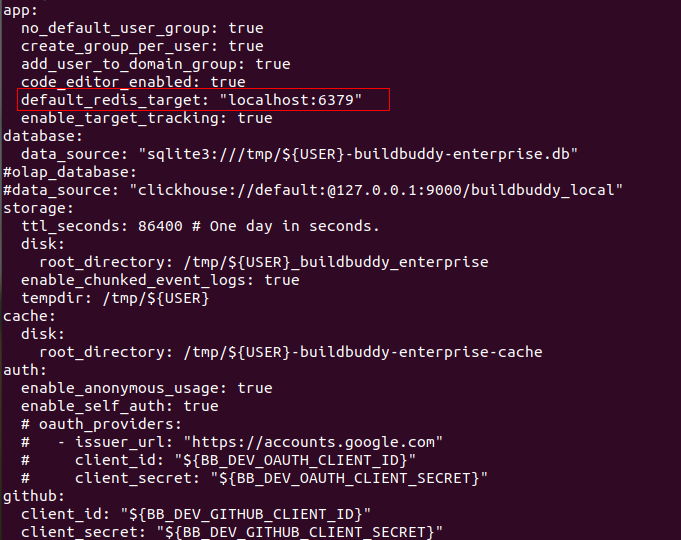

## 安装教程
操作系统：ubuntu 20.04

### 脚本安装

脚本使用说明 ./deploy.sh -h

deploy.sh脚本目前支持三种参数：
- easy：表示以简易方式运行系统，运行后将自动安装客户端、服务端、redis并进行配置
- c：表示安装客户端，一般和待编译的项目部署于同一物理机上
- s：表示安装服务端，运行时需要指定redis服务所在地址，如果配置已经完成只需要重复启动服务端，则无需指定地址参数
- e：表示安装编译节点，为了提高编译效率，一般单独部署于独立的物理机，运行时需要指定服务端地址，如果配置已经完成只需要重复启动服务端，则无需指定地址参数

① 简易安装

至少需要两台物理机A、B  
物理机A安装客户端和服务端  
物理机B安装编译节点，安装过程中需要指定服务端的ip地址(此处即物理机A的地址)，编译节点可按需扩充以提高编译效率

- 使用本项目中的部署脚本deploy.sh，并赋予执行权限
- 物理机A执行：./deploy.sh --easy
- 物理机B执行：./deploy.sh -e server_ip

② 标准安装

至少需要三台物理机ABC和redis环境 ([ubuntu安装redis教程](https://redis.io/docs/getting-started/installation/install-redis-on-linux/))  
物理机A安装客户端  
物理机B安装服务端，安装过程需要指定redis服务所在地址  
物理机C安装编译节点，安装过程需要指定服务端的ip地址(此处即物理机B的地址)，编译节点可按需扩充以提高编译效率

- 使用本项目中的部署脚本deploy.sh，并赋予执行权限
- 物理机A执行：./deploy.sh -c
- 物理机B执行：./deploy.sh -s redis_ip
- 物理机C执行：./deploy.sh -e server_ip

注：  
- 安装完成后，配置文件会保存在用户目录下的MyConfig文件夹中，包括：服务端配置文件server.yaml和编译节点配置文件executor.yaml
- 在实际使用时，参数和地址之间不需要添加空格，例：./redis.sh -s127.0.0.1
- 由于服务端不需要占用大量计算资源，为了减小网络延迟，用户可按需将服务端和客户端部署于同一台物理机上，因此脚本提供了简易安装方式
### 编译安装
注：编译安装需要下载大量文件，需在网络条件较好的情况下进行

① 安装客户端  
- 下载源代码：git clone https://gitee.com/mengning997/ninja.git
- 切换分支：git checkout common
- 安装依赖：sudo apt-get install -y git cmake g++ gcc googletest libgmock-dev libgoogle-glog-dev libssl-dev pkg-config uuid-dev grpc++ libprotobuf-dev protobuf-compiler-grpc ninja-build
- 编译：cmake -B build -G Ninja && cd build && ninja
- 替换原生Ninja：sudo mv /usr/bin/ninja /usr/bin/pre_ninja && sudo ln -s $(pwd)/ninja /usr/bin/ninja

② 安装Bazel([不同操作系统参考](https://bazel.build/install))  
注：安装服务端和编译节点都需要Bazel
- 安装依赖：apt install g++ unzip zip
- 下载Bazel安装程序：从 [GitHub上的Bazel版本页面](https://github.com/bazelbuild/bazel/releases) 下载名为 `bazel-version-installer-linux-x86_64.sh` 的Bazel二进制文件安装程序。
- 本文档使用bazel 6.0.0版本：wget https://github.com/bazelbuild/bazel/releases/download/6.0.0/bazel-6.0.0-installer-linux-x86_64.sh
- 添加执行权限：chmod +x bazel-6.0.0-installer-linux-x86_64.sh
- 运行安装程序：./bazel-6.0.0-installer-linux-x86_64.sh --user
- 设置环境变量：export PATH="\$PATH:\$HOME/bin"

② 安装服务端  
- 下载源代码：https://gitee.com/cloudbuild888/buildbuddy.git
- 编译：bazel build //enterprise/server:server
- 配置：  
  文件路径：buildbuddy/enterprise/config/buildbuddy.local.yaml  
    
  修改 app.default_redis_target 字段可指定redis服务所在地址  
  如需使用redis缓存编译文件，则需要添加cache.redis.redis_target: "redis服务地址"  
  如图：  
  
  
③ 安装编译节点
- 下载源代码：https://gitee.com/cloudbuild888/buildbuddy.git
- 编译：bazel build //enterprise/server/cmd/executor:executor
- 配置：  
  文件路径：buildbuddy/enterprise/config/executor.local.yaml  
    
  修改 executor.app_target 字段可指定服务端所在地址
