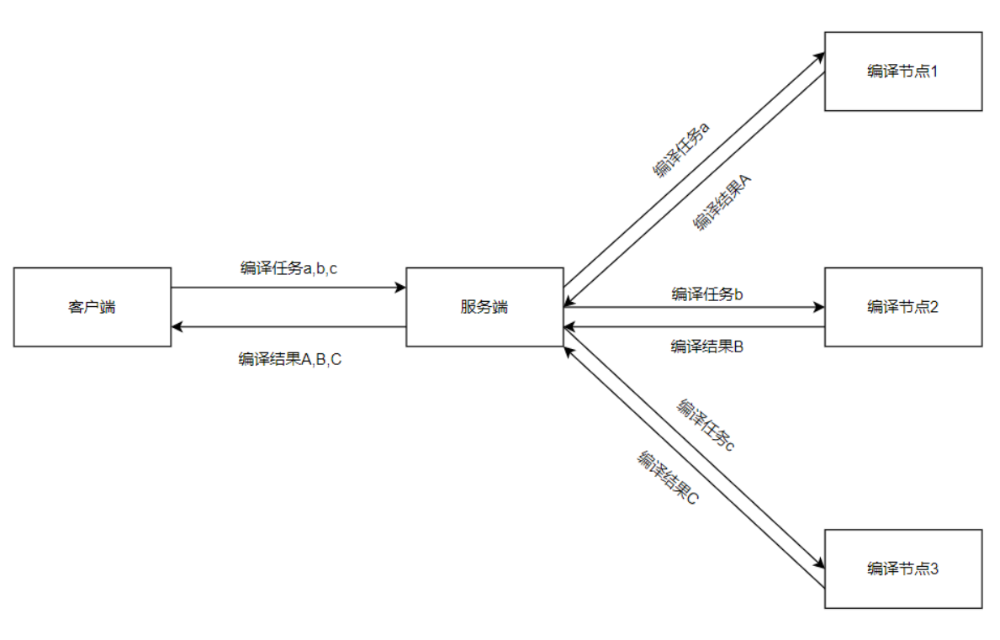
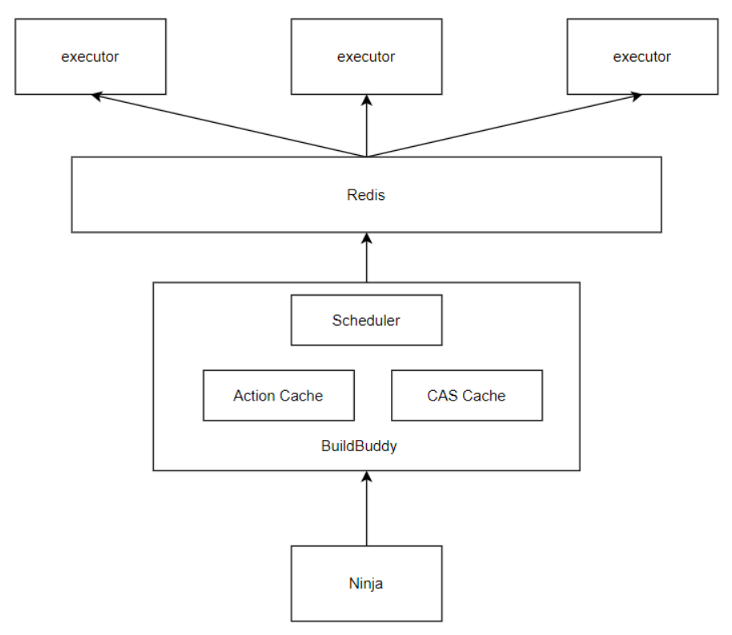

## 介绍
### 分布式编译
分布式编译（Distributed Compilation）是指在多台计算机上同时进行并行编译操作，以加快编译速度的一种技术。
分布式编译通常是分布和并行混合，即首先是任务分发到多台计算机上，然后具有多处理器的计算机进行并行编译，并把所有的编译产物汇总得到最终的编译结果。其工作原理可以理解为将单台计算机上的多核心并行编译方法扩展到了集群中，系统会将编译任务通过网络请求的形式分发到不同的计算机上，并利用集群的并行处理能力来同时执行这些任务，从而提高编译效率。

分布式编译可以显著加快大型项目的编译速度，特别是在多核CPU的计算机上，可以充分利用多核处理器的并行计算能力。同时，分布式编译也可以降低单个计算机的负载，提高编译效率和系统的响应速度。

分布式编译系统主要分为客户端，服务端，编译节点三个部分。

客户端：以开源项目Ninja为基础，原Ninja为本地构建系统，改造后可将Ninja本地构建过程中实际的编译任务发送给服务端进行执行。

服务端：以开源项目BuildBuddy为基础，改造后可支持redis集群和以bash方式执行任务。主要完成任务调度，远程编译，远程缓存这些功能。

- 任务调度功能负责将来自Ninja的编译任务分发到编译节点。
- 远程编译功能负责连接到编译节点并传输编译所需的依赖文件和保存编译节点返回的结果。
- 远程缓存功能负责将编译结果进行缓存，供不同编译节点和客户端使用。

编译节点：真正执行编译任务的地方，并将编译结果返回至服务端。

### 软件架构
1. Ninja：客户端，客户端的机器上需要保存有完整的项目源代码，负责发送编译任务，接收编译结果。
2. Action Cache：服务端缓存，主要保存编译任务的执行结果，包括：输出文件名，退出代码，标准输出，标准错误等。
3. CAS Cache：服务端缓存，主要保存客户端上传的依赖文件，编译输出文件。
4. Scheduler：任务调度器，负责将编译任务ID分发到各个编译节点。
5. Redis：主要存储具体的编译任务供编译节点领取执行，也可存储Action Cache和 CAS Cache中的内容加速编译。
6. executor：连接到服务端的各个编译节点。

