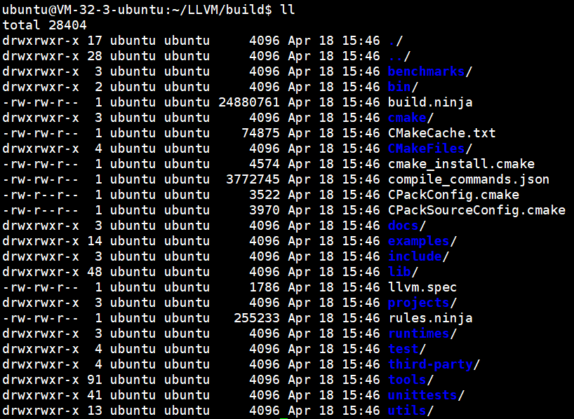
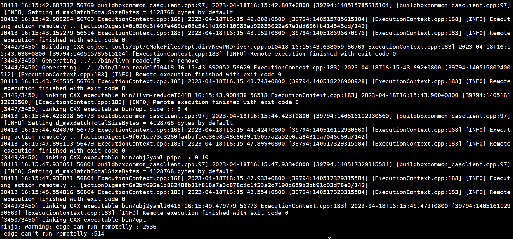
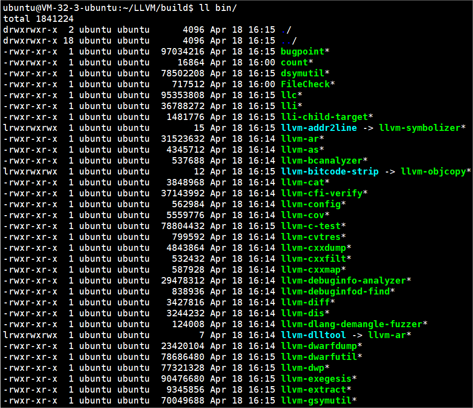
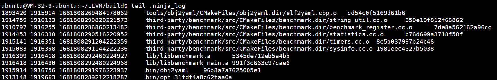
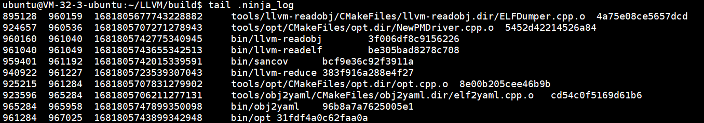

## 系统环境 

CPU：AMD EPYC™ Rome(2.6GHz/3.3GHz) 8核  

内存：16GB

系统版本：ubuntu 20.04

## 项目地址
https://gitee.com/mirrors/LLVM.git

## 编译步骤

- 进入项目

- 生成Ninja工程文件：cmake -S llvm -B build -G Ninja -DCMAKE_BUILD_TYPE=MinSizeRel

- 启动编译：ninja -c grpc://127.0.0.1:1985 -p /home/ubuntu/LLVM

## 运行结果

## 验证
###单机编译

使用单机编译，根据Ninja日志显示，需要约32min

###分布式编译

使用两个编译节点，根据Ninja日志显示，需要约16min

验证可见：分布式编译极大地提高了编译效率，随着编译节点的增加，效率将得到进一步提升