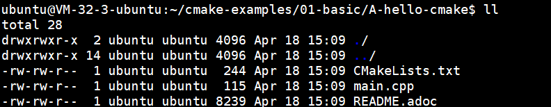
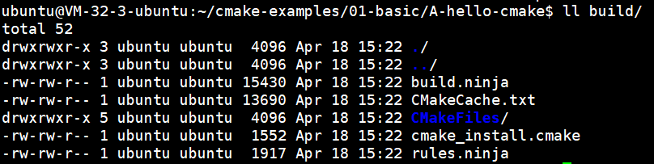
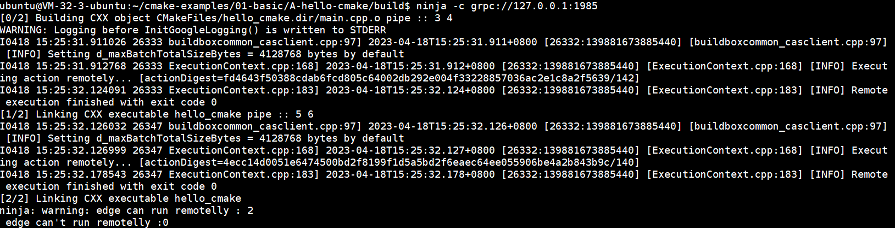
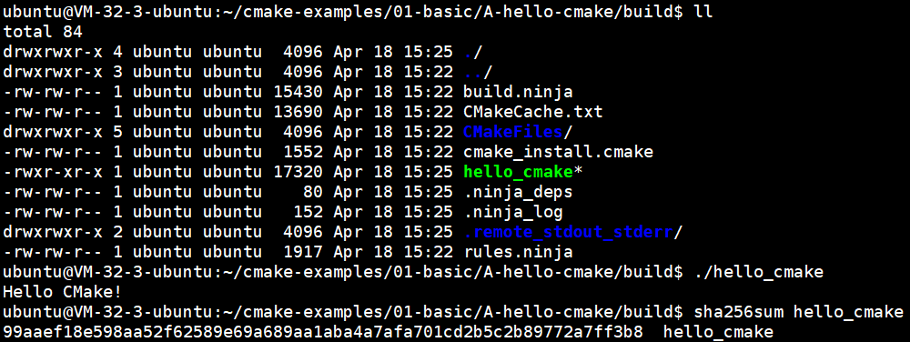
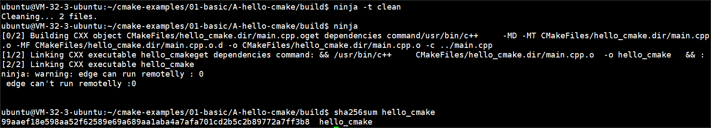

## 项目地址
https://github.com/ttroy50/cmake-examples.git
## 编译步骤
- 进入项目  


  
- 生成Ninja工程文件：cmake -B build -G Ninja  


  
- 启动编译：ninja -c grpc://127.0.0.1:1985
> 如果出现如下类似错误，可以使用 -r 参数将项目主目录绝对路径转成相对路径。示例完整命令: `ninja -c grpc://127.0.0.1:1985 -r ~/notes/cmake-examples/01-basic/A-hello-cmake/`
```shell
stderr:c++: error: /home/chanfun/notes/cmake-examples/01-basic/B-hello-headers/src/Hello.cpp: No such file or directory
c++: fatal error: no input files
compilation terminated.
```




## 运行结果



## 验证
本地单机编译


验证可见：分布式编译和单机编译的结果是一致的  
由于此demo较小，不进行效率比较，只进行编译正确性验证