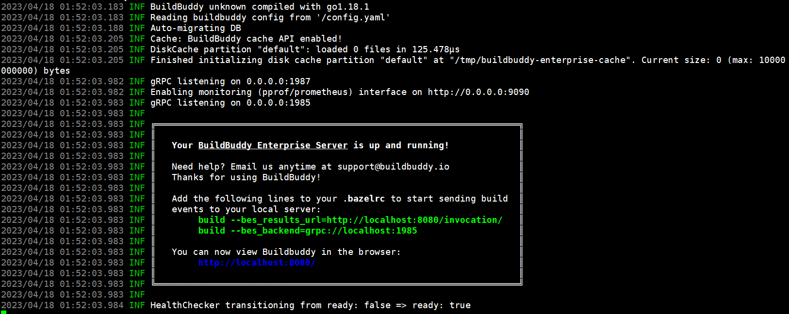
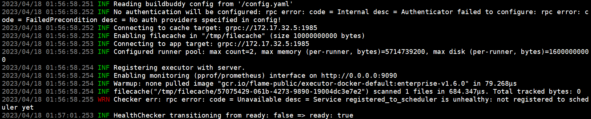

# 运行服务端
运行截图

① 简易方式  
- ./deploy.sh --easy

使用easy参数初次安装系统时将自动运行服务端程序

② 标准方式  
初次运行需要指定redis服务地址，本文档redis地址：172.17.32.2
- ./deploy.sh -s172.17.32.2

若非初次运行，且不需要修改地址信息，则无需指定地址参数
- ./deploy.sh -s

③ 命令行方式  
命令行启动服务端适用于编译安装方式
- bazel run //enterprise/server:server

# 运行编译节点
运行截图

① 标准方式
初次运行需要指定服务端地址，本文档服务端地址：172.17.32.3
- ./deploy.sh -e172.17.32.3

若非初次运行，且不需要修改地址信息，则无需指定地址参数
- ./deploy.sh -e

② 命令行方式
命令行启动服务端适用于编译安装方式
- bazel run //enterprise/server/cmd/executor:executor	

# 启动分布式编译
以普通的CMake项目为例
- 生成Ninja工程文件：cmake -B build -G Ninja
- 指定服务端地址启动分布式编译：ninja -c grpc://127.0.0.1:1985

